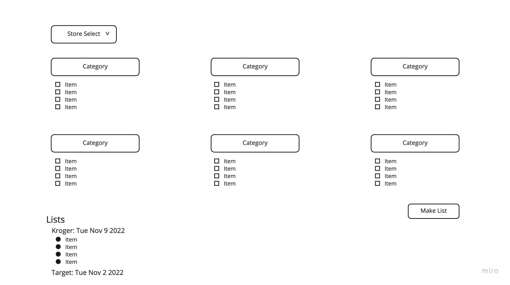

# List Generator

This project has you building a web application that allows a user to generate shopping lists for a specific store by selecting items on the page.

## Learning Objectives

This is an advanced project that covers:

- Modular code
- Complex algorithms
- ERD's and many-to-many relationships
- State
- Event handling
- Custom events
- Advanced CSS
- Googling skills

There are multiple concepts covered in this project which have not been covered in the coursework. This is where you get to practice your googling skills. Some hints will be provided to you.

Some tickets have been made for you, but you will need to create more, breaking down the requirements into smaller chunks. This is where you get to practice your algorithmic and analytical thinking.

Before writing any code, review the requirements and make an ERD. Review your ERD with an instructor before making changes to the database.

## Wireframe

This is the general layout provided by your product owner. Please follow this guideline for your project's layout.

## Workflow animation

This animation shows you the basic behavior of the application.

## Application overview

List Generator is an app that allows a user to generate a shopping list by selecting items from a specific store.

- The user will be able to see all the item categories on the page.
- The user will have the ability to select a store from a dropdown.
- Once a store is chosen, the items from the selected store will be displayed on the page under the correct categories.
- The user will have the ability to select the items they want to build their shopping list.
- When the user clicks on the "Make list" button, the list will display at the bottom of the page with the store name and the date it was created.
- When the user clicks on the list, it will expand, displaying the contents of the list. Clicking on the list name again will collapse the list.

## Data relationships

Below you can ready some basic information about the properties and relationships of the data you need for this application.

### Items

Each item has a name and belongs to one category. _(ex. Milk, Windex, Paper Towels)_
An item may be sold at multiple stores.

### Categories

Each category has a name. _(ex. Household, Pantry)_
Many items can belong to a single category.

### Stores

A store has a name. _(ex. Target, Kroger)_
A store has many items.

### Lists

A list is created by the user.
The user can see what store the list was created for and when the list was created.
